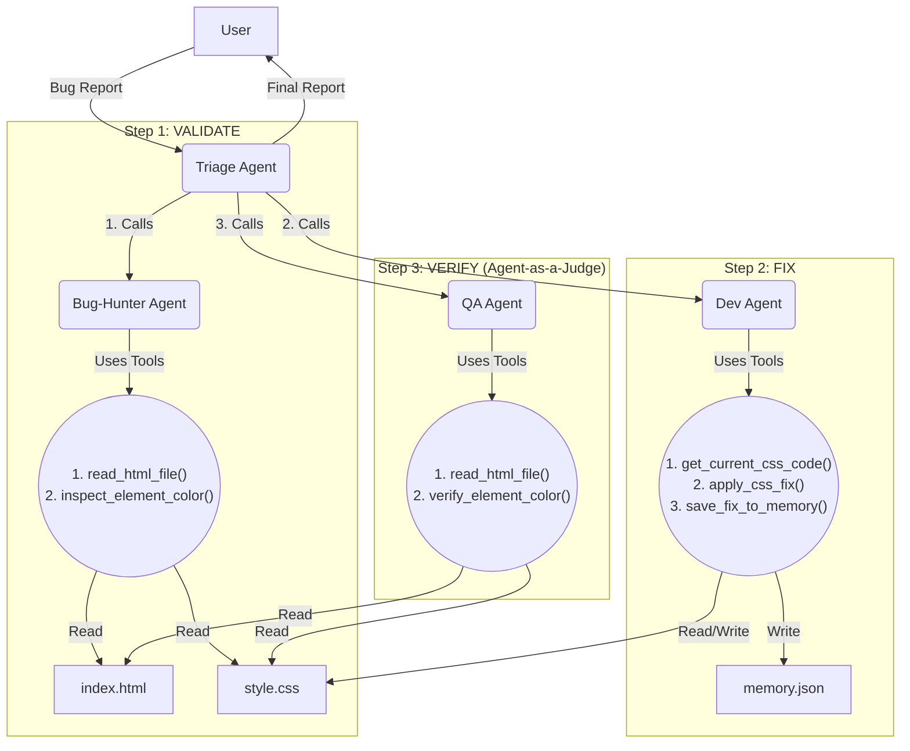

# Agentic-Evolver: A Self-Healing Agent Syste

**Kaggle AI Agents Capstone: A multi-agent system using Gemini, Procedural Memory, and Agent-as-a-Judge to autonomously fix website bugs.**

---

## 1. The Pitch: Core Concept & Value

This project is not a single-agent demo; it is a **production-grade, collaborative multi-agent system** built to showcase the advanced concepts from the 5-Day AI Agents Intensive.

The core concept is to build an autonomous "AgentOps" team that can:
1.  **Observe** a user-reported bug.
2.  **Orchestrate** a team of specialist agents to validate and fix the bug.
3.  **Evaluate** its own work using an autonomous QA "Judge" agent.
4.  **Learn** from its success by saving the solution to procedural memory.

This architecture demonstrates a **Level 3: Collaborative Multi-Agent System** that is robust, observable, and built to "evolve"—which is the core of production-ready agentic design.

---
## 2. The Architecture: A 4-Agent "AgentOps" Team

System is composed of four distinct, specialized agents that collaborate to solve a problem.

### 1. The "Triage" Agent (The Manager)
* **Model:** `gemini-2.0-flash`
* **Job:** Acts as the "Coordinator" or "Project Manager." It receives the initial bug report from the user. Its "tools" are the other three agents. It follows a strict workflow: **VALIDATE -> FIX -> VERIFY**.

### 2. The "Bug-Hunter" Agent (The Specialist)
* **Model:** `gemini-2.0-flash-lite`
* **Job:** A "v2" specialist agent responsible for bug validation. We evolved this agent to be fully autonomous. It uses a 2-step process:
    1.  **Find Selector:** It reads the `index.html` file to find the correct CSS selector from the user's plain-English description.
    2.  **Inspect Color:** It inspects the `style.css` file to get the *actual* color.
    It then compares its finding to the user's report and returns a `VALIDATED` or `NOT VALID` judgment.

### 3. The "Dev" Agent (The Coder & Scribe)
* **Model:** `gemini-2.0-flash`
* **Job:** An autonomous programmer. It reads the `style.css` file, generates the correct fix, and overwrites the file. Crucially, it then uses a tool to write its solution into `memory/procedural_memory.json`, demonstrating **Procedural Memory**.

### 4. The "QA" Agent (The Judge)
* **Model:** `gemini-2.0-flash-lite`
* **Job:** This is our **"Agent-as-a-Judge"**. After the Dev Agent applies a fix, this agent autonomously re-runs the *entire* validation process (read HTML, find selector, inspect CSS) to verify the fix. It then returns a final **`PASS`** or **`FAIL`** judgment.


---

## 3. Showcasing the 5-Day Course Concepts

This project was built to directly implement the core concepts from each day of the course.

* **✅ 1. Multi-Agent Architecture (Day 1):** Built a "Coordinator" (Triage) that manages a "team of specialists" (Bug-Hunter, Dev, QA). This is a robust, scalable pattern far superior to a single "do-it-all" agent.

* **✅ 2. Specialized Tools & Autonomous Reasoning (Day 2):** Demonstrated true agent autonomy. Our "v1" Bug-Hunter agent was "blind" and had to *ask* for the CSS selector. We "evolved" it into a "v2" agent by giving it a new tool (`read_html_file`) and a smarter prompt, allowing it to *find* the selector on its own.

* **✅ 3. Procedural Memory (Day 3):** Dev Agent doesn't just fix a bug; it *learns* from it. After a successful fix, it writes the solution to `memory/procedural_memory.json`. This is "Procedural Memory" (how-to knowledge), a core concept for building agents that improve over time.

* **✅ 4. Agent-as-a-Judge & Observability (Day 4):** QA Agent acts as an "Agent-as-a-Judge," autonomously evaluating the work of the Dev Agent. The entire system is built to be "observable"; the `verbose=True` logs in the terminal are our **Observability Trace**, which we used to find and fix all our reasoning bugs.

* **✅ 5. AgentOps & Evolution (Day 5):** Entire development process *was* the "AgentOps" loop. We used our Observability Traces to **Observe** logical failures (like the agent getting confused) and **Evolved** their prompts (their "brains") to make them more robust and reliable.

---

## 4. Bonus Points

* **⭐ Effective Use of Gemini (5 points):** Yes. **All four** of agents are powered by the Gemini family of models (`gemini-2.0-flash` and `gemini-2.0-flash-lite`), demonstrating a "team of specialists" approach.

---

## 5. How to Run This Project

### Prerequisites
* Python 3.11+
* Git

### Step 1: Clone the Repository
In your terminal, clone the repository:
```bash
git clone [https://github.com/Jainilbro/Agentic-Evolver.git](https://github.com/Jainilbro/Agentic-Evolver.git)
cd Agentic-Evolver
````

### Step 2: Create and Activate a Virtual Environment

**For Windows (in PowerShell):**

```bash
python -m venv .venv
.\.venv\Scripts\Activate.ps1
```

**For macOS/Linux:**

```bash
python3 -m venv .venv
source .venv/bin/activate
```

### Step 3: Install Dependencies

With your virtual environment active, install all required libraries:

```bash
pip install -r requirements.txt
```

### Step 4: Create Your Secret Key File

1.  Create a new file in the root of the project folder (at the same level as `main.py`) named `.env`
2.  Open this file and add your Google AI Studio API key:
    ```
    GOOGLE_API_KEY=YOUR_API_KEY_HERE
    ```

### Step 5: Reset Project State (Important\!)

Before running for the first time, make sure the project is in its "buggy" state:

1.  Open `world/style.css` and ensure the `background-color` is blue (`#007bff`).
2.  Open `memory/procedural_memory.json` and ensure it contains only `[]` (an empty list).

-----

## 6. How to Test (The Demo)

Run the main script to start the Triage Agent:

```bash
python main.py
```

### Test Case 1: The "Blue to Red" Fix (Happy Path)

  * **Action:** When the agent asks, type in this bug report:
    `The contact button is blue, it should be red.`
  * **Observe:** Watch the full terminal trace. You will see the `Triage Agent` call the `Bug-Hunter Agent`, which will `read_html_file`, `inspect_element_color`, and report `VALIDATED`. Then, the `Dev Agent` will run, writing the fix to the file and updating its memory. Finally, the `QA Agent` will run and report **`PASS`**.
  * **Check Files:** After it's done, open `world/style.css` (it will now be red) and `memory/procedural_memory.json` (it will have the new fix recorded).

### Test Case 2: The "Red to Blue" Fix (Proof of Autonomy)

  * **Action:** Run the script again: `python main.py`
  * **Action:** When the agent asks, type in the *new* bug:
    `The contact button is red, it should be blue.`
  * **Observe:** Watch the agents follow the exact same logic, but with the *new* instructions, to change the button *back* to blue. This proves the system is not hard-coded and is autonomously reasoning.

### Test Case 3: The "Out of Scope" Rejection (Proof of Robustness)

  * **Action:** Run the script again: `python main.py`
  * **Action:** When the agent asks, type in a bug it wasn't trained for:
    `The h1 title is wrong, it should be "My Website"`
  * **Observe:** Watch the `Bug-Hunter Agent` correctly use its `read_html_file` tool, find the `<h1>` tag, and then realize it has no tool to check a *text* bug (only a color bug). It will report this to the `Triage Agent`, which will correctly stop the workflow without trying to apply a fix. This proves our "specialist" agent is robust and safely rejects tasks outside its scope.

